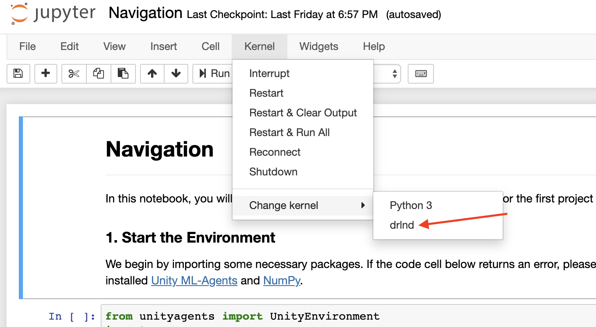

# Deep Reinforcemeet Learning - Mr Banana Grabber

## Introduction

This is a project in the Udacity Deep Reinforcement Learning Program

---

A reward of +1 is provided for collecting a yellow banana, and a reward of -1 is provided for collecting a blue banana.  The goal of the agent is to collect as many yellow bananas as possible while avoiding blue bananas.

The state space has 37 dimensions and contains the agent's velocity, along with ray-based perception of objects around agent's forward direction.  Given this information, the agent has to learn how to best select actions.  Four discrete actions are available, corresponding to:
- **`0`** - move forward.
- **`1`** - move backward.
- **`2`** - turn left.
- **`3`** - turn right.

The task is episodic, and in order to solve the environment, your agent must get an average score of +13 over 100 consecutive episodes.

---

## Getting Started

Create the environment
```bash
conda create --name drlnd python=3.6
source activate drlnd
```
Follow the instructions in this [repository](https://github.com/openai/gym) to perform a minimal install of OpenAI gym.

* Next, install the classic control environment group by following the instructions [here](https://github.com/openai/gym#classic-control).
* Then, install the box2d environment group by following the instructions [here](https://github.com/openai/gym#box2d).

Create an [IPython kernel](http://ipython.readthedocs.io/en/stable/install/kernel_install.html) for the drlnd environment.
```bash
python -m ipykernel install --user --name drlnd --display-name "drlnd"
```

Start jupeter-notebooks and set the kernel
```bash
jupyter-notebook
```



You will need to download the unity environment and possibly make changes in the python code in cell #2 to that loads the unity environment.

Downloads are:
* Linux: [click here](https://s3-us-west-1.amazonaws.com/udacity-drlnd/P1/Banana/Banana_Linux.zip)
* Mac OSX: [click here](https://s3-us-west-1.amazonaws.com/udacity-drlnd/P1/Banana/Banana.app.zip)
* Windows (32-bit): [click here](https://s3-us-west-1.amazonaws.com/udacity-drlnd/P1/Banana/Banana_Windows_x86.zip)
* Windows (64-bit): [click here](https://s3-us-west-1.amazonaws.com/udacity-drlnd/P1/Banana/Banana_Windows_x86_64.zip)

You should now be able to proceed with running/training your own version.

Follow the instructions in the notebook - most notably where to download the appropriate version of the banana application (this was done on OSX)

Step #3 has been disabled for you, if you want to see and untrained version you may enable it.

If running into any issues restart the kernel and begin running the notebook cells again.

If you just want to see the trained models run, they have been provided to you in the `trained_models` folder. Simply run the one of your choosing.

---

## CNN Q Network on AWS Deep Learning AMI (Ubuntu 16.04)

Note:
===

When using this environment it will cost money! Make sure to shut down and terminate the environment you create. Secondly, it will train, but it will take a long time. There are likely some improvements that can be made but in its current state it will use a lot of GPU time. To see an example of this project that can be run on CPU use the above DQN or Double DQN

You don't need to use the NoVis Environment for this. The below instructions setup a virtual screen that will render and return the visuals.

You should also be able to run this network locally by executing the command

```bash
python cnn.py
```

---

### Step 1: Choose AMI

Create a new instance in the EC2 panel and search for the AMI `ami-016ff5559334f8619` it can be found in region `us-east-1`

Select continue

##### OR

Follow the build instruction here: [Training on Amazon Web Service](https://github.com/Unity-Technologies/ml-agents/blob/master/docs/Training-on-Amazon-Web-Service.md)

#### Step 2: Choose instance type

Select Family: `GPU Instances` Type: `p2.xlarge`

#### Step 3: Configure Instance

next

#### Step 4: Add Storage

next

#### Step 5: Add Tags

configure any tags you see fit

#### Step 6: Configure Security Group

allow ssh connections (default) - create new security group

#### Launch

create new keypair and download

when the instance is running connect to it using the pem file previously downloaded in `Step 6`

```bash
# change permissions on pem file
chmod 600 ~/.ssh/p2-xlarge-drl.pem

# connect
ssh -i ~/.ssh/p2-xlarge-drl.pem ubuntu@{hostname found in ec2 dashboard}
```

Start x server and use it
```bash
# Start the X Server, press Enter to come back to the command line
sudo /usr/bin/X :0 &

# Check if Xorg process is running
# You will have a list of processes running on the GPU, Xorg should be in the list.
nvidia-smi

# Make the ubuntu use X Server for display
export DISPLAY=:0
```

Ensure it is configured
```bash
# For more information on glxgears, see ftp://www.x.org/pub/X11R6.8.1/doc/glxgears.1.html.
glxgears
# If Xorg is configured correctly, you should see the following message

# Running synchronized to the vertical refresh.  The framerate should be
# approximately the same as the monitor refresh rate.
# 137296 frames in 5.0 seconds = 27459.053 FPS
# 141674 frames in 5.0 seconds = 28334.779 FPS
# 141490 frames in 5.0 seconds = 28297.875 FPS
```

```bash
# clone environment from git
git clone https://github.com/kelstopper/drl_navigation.git && cd drl_navigation

# copy headless linux app
curl https://s3-us-west-1.amazonaws.com/udacity-drlnd/P1/Banana/VisualBanana_Linux.zip > VisualBanana_Linux.zip
unzip VisualBanana_Linux.zip

# use the pytorch env
source activate pytorch_p36
pip install unityagents

# run the cnn example, verify that it is running on CUDA in the logs
## "Training on CUDA" <<< Should be present if "Training on CPU" is present you are training on cpu and it WILL take longer and cost more
python cnn.py
```

Shutdown xorg?
```bash
sudo killall Xorg
```