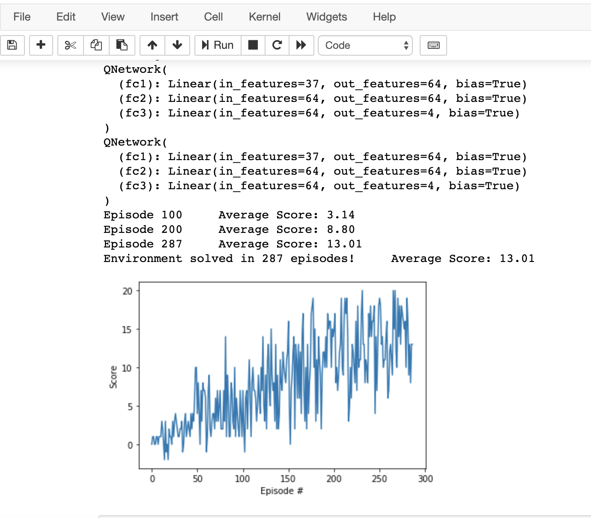
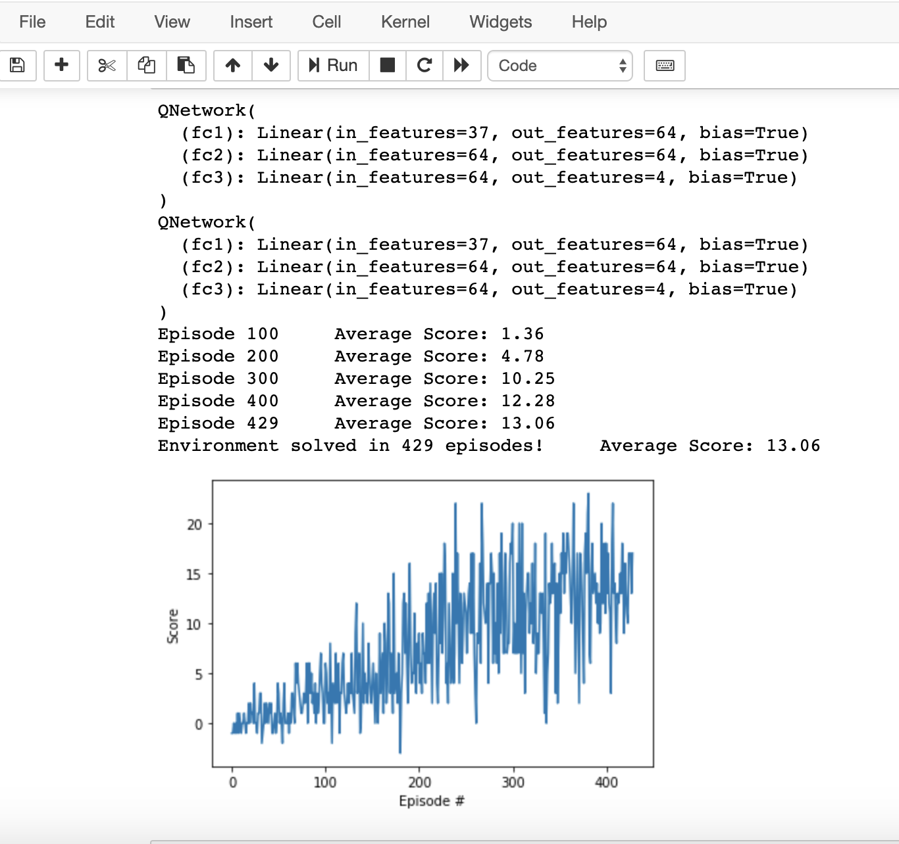

# Report

## Learning Algorithm

Two learning algorithms were chosen to test with a standard DQN and Double DQN.

---

### DQN:

This DQN followed the pretty typical dqn used in examples through out the project. 

The network consisted of 3 fully connected layers, the first two were then passed through a ReLU function.

Hyperparameters:
```python
* BUFFER_SIZE = int(1e5)  # replay buffer size
* BATCH_SIZE = 64         # minibatch size
* GAMMA = 0.99            # discount factor
* TAU = 1e-3              # for soft update of target parameters
* LR = 5e-4               # learning rate 
* UPDATE_EVERY = 4        # how often to update the network

* n_episodes=2000         # maximum number of training episodes
* max_t=3000              # maximum number of timesteps per episode
* eps_start=1.0           # starting value of epsilon, for epsilon-greedy action selection
* eps_end=0.01            # minimum value of epsilon
* eps_decay=0.95         # multiplicative factor (per episode) for decreasing epsilon
```

---

### Double DQN:

This was updated based on the documentation provided for a Double DQN, which is very similar to the original DQN model. To remove the potential overestimation of actions in noisy environments each Q function is updated with a value from the other Q function for the next state.

The network consisted of 3 fully connected layers, the first two were then passed through a ReLU function.

Hyperparameters:
```python
* BUFFER_SIZE = int(1e5)  # replay buffer size
* BATCH_SIZE = 64         # minibatch size
* GAMMA = 0.99            # discount factor
* TAU = 1e-3              # for soft update of target parameters
* LR = 5e-4               # learning rate 
* UPDATE_EVERY = 4        # how often to update the network

* n_episodes=2000         # maximum number of training episodes
* max_t=3000              # maximum number of timesteps per episode
* eps_start=1.0           # starting value of epsilon, for epsilon-greedy action selection
* eps_end=0.01            # minimum value of epsilon
* eps_decay=0.95          # multiplicative factor (per episode) for decreasing epsilon
```

---

## Rewards - Success!

DQN:


DDQN:


## Future improvements or research areas

* Adding other networks, dueling, prioritized experience replay and rainbow
* Play with the hyperparameters, currently the DDQN takes more episodes
* work on improving the CNN